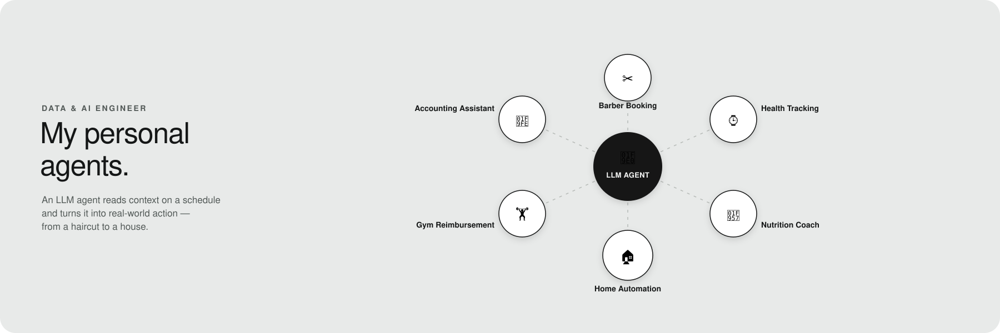

# Hi, I'm Igor 👋 🇧🇷

Here you can find more details about my personal projects and agents. I've also merged open-source contributions into [Dagster](https://github.com/dagster-io/dagster/pull/31460) and [Metabase's dataset-generator](https://github.com/metabase/dataset-generator/pull/15).

| Repo | What it does |
|---|---|
| **[garmin-dashboard](https://github.com/cletoigor/garmin-dashboard)** | Pulls daily health/activity data from Garmin Connect on a cron and serves a live dashboard of sleep, training load, and recovery trends. |
| **[pfc-ufmg-igor-cleto](https://github.com/cletoigor/pfc-ufmg-igor-cleto)** | My undergraduate thesis (TCC): a full IoT data platform for a real Tuya-connected smart home, with an AI agent that can query and control it. |
| **[barber-automation](https://github.com/cletoigor/barber-automation)** | Books my weekly haircut/beard trim automatically via the BestBarbers API — checks availability, picks the right slot, confirms. |
| **[nutri-dash](https://github.com/cletoigor/nutri-dash)** | Flexible-diet tracker where **Claude Code is the brain**: it parses my nutritionist's PDF plan, suggests meal substitutions that preserve macros (weighted least-squares against the TACO food table), and logs what I actually ate — the Flask app is just a read-only viewer. |
| **[reembolso-academia](https://github.com/cletoigor/reembolso-academia)** | Fills out and submits my monthly gym-reimbursement form and notifies the right person on Slack. |
| **[senhor-contabil](https://github.com/cletoigor/senhor-contabil)** | Automates the accounting workflow for my company: reconciles monthly tax filings (DAS/GPS/NFS-e), issues export invoices, and updates payroll. |

---

## 🛠 Meta — dashboards that watch the automations

| Repo | What it does |
|---|---|
| **[cron-dashboard](https://github.com/cletoigor/cron-dashboard)** | Minimal localhost dashboard to monitor every crontab job above — status, logs, next run time, and a run-now button. |
| **[skills-dashboard](https://github.com/cletoigor/skills-dashboard)** | Launcher/monitor for the Claude Code skills that drive these agents. |

