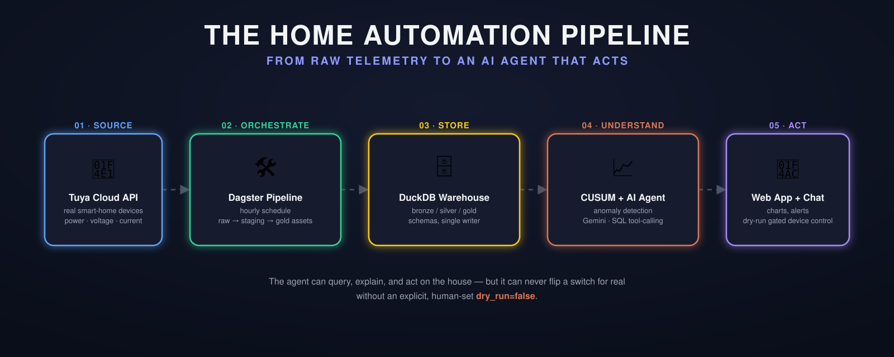

# Igor Cleto

## My Personal Agents

---

## 🏠 Home Automation + AI Agent — my undergraduate thesis (TCC)

**[pfc-ufmg-igor-cleto](https://github.com/cletoigor/pfc-ufmg-igor-cleto)** — a full IoT data platform for a real Tuya-connected smart home, built as my Control and Automation Engineering thesis.

- **Dagster pipeline** ingests device telemetry (power, voltage, current, on/off events) every hour and lands it through a bronze → silver → gold DuckDB warehouse.
- **Statistical process control**: a from-scratch multichannel CUSUM detector flags abnormal energy draw per device, per hour-of-day — the core of the thesis's chapter 3 method, unit-tested against hand-computed numbers.
- **AI agent** (Gemini by default, Ollama/Claude optional) answers natural-language questions over the warehouse, reads live device state, and can actuate devices — gated behind a dry-run-by-default safety layer the model itself can never disable.
- **Web app + dashboard**: a no-build-step vanilla JS frontend (Starlette backend) and a Streamlit fallback, charting energy/state history and hosting the agent chat live over SSE.

---

## 🤖 Personal automations — run by Claude Code, on a cron

One coordinator, many small agents. [Claude Code](https://claude.com/claude-code) skills wired to local cron jobs each own one recurring chore, most with a tiny Flask dashboard to watch them work.

| Repo | What it does |
|---|---|
| **[barber-automation](https://github.com/cletoigor/barber-automation)** | Books my weekly haircut/beard trim automatically via the BestBarbers API — checks availability, picks the right slot, confirms. |
| **[garmin-dashboard](https://github.com/cletoigor/garmin-dashboard)** | Pulls daily health/activity data from Garmin Connect on a cron and serves a live dashboard of sleep, training load, and recovery trends. |
| **[nutri-dash](https://github.com/cletoigor/nutri-dash)** | Flexible-diet tracker where **Claude Code is the brain**: it parses my nutritionist's PDF plan, suggests meal substitutions that preserve macros (weighted least-squares against the TACO food table), and logs what I actually ate — the Flask app is just a read-only viewer. |
| **[reembolso-academia](https://github.com/cletoigor/reembolso-academia)** | Fills out and submits my monthly gym-reimbursement form and notifies the right person on Slack. |
| **[senhor-contabil](https://github.com/cletoigor/senhor-contabil)** | Automates the accounting workflow for my company (Cleto Tecnologia): reconciles monthly tax filings (DAS/GPS/NFS-e), issues export invoices, and updates payroll. |

---

## 🛠 Meta — dashboards that watch the automations

| Repo | What it does |
|---|---|
| **[cron-dashboard](https://github.com/cletoigor/cron-dashboard)** | Minimal localhost dashboard to monitor every crontab job above — status, logs, next run time, and a run-now button. |
| **[skills-dashboard](https://github.com/cletoigor/skills-dashboard)** | Launcher/monitor for the Claude Code skills that drive these agents. |

---

### 📊 GitHub stats

